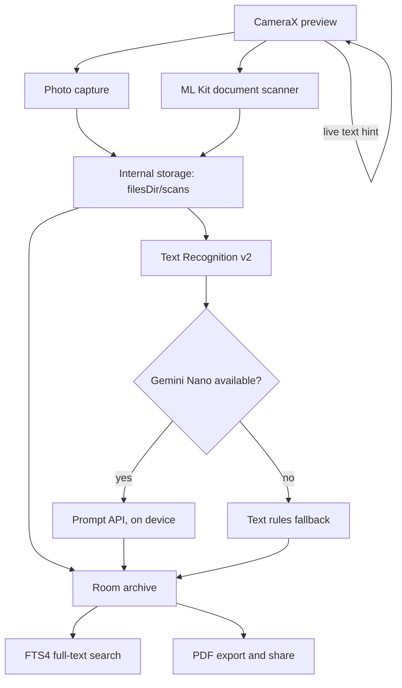

# SnapDoc

[](https://github.com/hacybeyker/SnapDoc/actions/workflows/ci.yml)
[](https://github.com/hacybeyker/SnapDoc/actions/workflows/release.yml)


> A document scanner that **understands what it scans** — and never sends it anywhere. Edge detection,
> perspective correction, OCR and generative AI all run **on the phone**, with **CameraX**, **ML Kit** and
> **Gemini Nano**. Zero data leaves the device.

Point the camera at a receipt: SnapDoc straightens it, reads it, works out that it *is* a receipt, pulls
out the shop, the date and the total, files it in a searchable archive and can hand it to any app as a PDF.
Offline, with no account and no per-request cost.

---

## ✨ What it does

| | |
|---|---|
| **Guided scanning** | ML Kit Document Scanner: edge detection, cropping, perspective correction and multi-page scans, plus plain photo capture with CameraX |
| **Live framing help** | `ImageAnalysis` reads the viewfinder while it is open and says how much text is in frame, so the page is framed *before* the shot — with real backpressure, not a queue of stale frames |
| **On-device OCR** | Text Recognition v2 per page, selectable and copyable. A page with nothing readable on it is reported as empty, not as a failure |
| **On-device understanding** | Gemini Nano through ML Kit's Prompt API classifies the document and extracts merchant, date and total. Where the model is unavailable, text rules answer instead — and the screen always says which of the two replied |
| **Searchable archive** | Every scan is kept in Room the moment the camera produces it. Full-text search runs over the recognized text itself, so a receipt is found by typing the shop that printed it |
| **PDF export** | Each page drawn onto an A4 sheet, scaled and centred, shared through a `FileProvider` under a name you can recognize in an inbox: `receipt_hardware-store_20260820_1330.pdf` |

---

## 🔬 The pipeline



The archive is written **before** the text is read, not after: a scan the user took is theirs whether or
not anything readable came out of it. Reading it later enriches the same entry instead of creating a
second one — which is also how an insight upgraded by a newly downloaded model reaches the archive.

---

## 🧠 On-device AI, and what happens without it

The generative step needs **AICore** and a supported device — Pixel 8+, Galaxy S24+ and similar. Everything
else in the app works everywhere, and that is a design decision, not a limitation:

- **Availability is checked, never assumed.** Every call into the analyzer is contained; if the client
  cannot even be created, the app degrades instead of breaking.
- **A model that fails halfway falls back too.** Eviction, thermal throttling and a text longer than the
  context window are not reasons to leave the user with no answer while the rules can still give one.
- **The rules never invent a merchant.** "The first line is the shop" is right just often enough to be
  dangerous; a wrong shop is worse than a missing one.
- **The UI names the engine.** *Read on this device by Gemini Nano* vs *Read with text rules* — without
  that, an empty field would look like a document with no shop name on it.

> ⚠️ `com.google.mlkit:genai-*` is pre-release, and it is the project's single documented exception to the
> "stable dependencies only" rule (see `AGENTS.md`): there is no stable path to Gemini Nano today. What
> makes it acceptable is that the fallback is not optional — the app behaves correctly on a device where
> that dependency does nothing at all.

---

## 🔒 Privacy

Images, recognized text and insights stay in the app's internal storage and its Room database. Nothing is
uploaded, and there is no analytics or network layer to upload it with. The only thing that ever leaves is
a PDF the user explicitly shares: the `FileProvider` exposes **only** `cacheDir/exports/`, is not exported
to other apps, and grants access to the one URI handed to the chooser.

---

## 🏗️ Architecture

**Vertical Slice** + Clean layering inside each slice + **MVI** in the UI. A feature owns its `domain`,
`data` and `ui`; shared code moves to `core/` only once a second feature actually needs it.

```
app/src/main/java/com/hacybeyker/snapdoc/
├── core/
│   ├── coroutines/        # @IoDispatcher qualifier
│   ├── database/          # Room database + Hilt module
│   ├── document/          # DocumentInsight — promoted here once two slices needed it
│   └── ui/                # Design tokens (Spacing, Shapes, Type) and shared components
├── feature/
│   ├── camera/            # Permission, CameraX preview, capture, guided scanning, live hint
│   ├── home/              # Entry screen with the most recent scans
│   ├── library/           # Archive, full-text search, PDF export
│   └── ocr/               # Text recognition and document understanding
└── navigation/            # NavKeys + AppNavHost (Navigation 3)
```

Two rules carry most of the weight:

- **The Screen owns the platform handles, the ViewModel owns the state.** `SurfaceRequest`, `ImageCapture`
  and the scanner's `IntentSender` never enter the `UiState`, which is why every ViewModel is testable on
  the JVM with hand-written fakes — no Robolectric, no MockK.
- **One-shot events are effects, not state.** Launching the system dialog, opening the scanner, sharing a
  PDF and handing pages to the reader all travel through a `Channel`, so they fire exactly once.

---

## ⚡ Run

```bash
./gradlew assembleDebug    # or Run from Android Studio
```

Requires JDK 21. The guided scanner needs Google Play services, so an emulator image without Play Store
will report the scanner as unavailable — by design, that is a state, not a crash.

---

## 🧪 Tests

```bash
./gradlew test                 # 164 JVM tests, no emulator needed
./gradlew koverVerifyDebug     # coverage gate: 90% of domain, data and ViewModels
./gradlew verifyRoborazziDebug # screenshot gate: 17 committed goldens
./gradlew recordRoborazziDebug # re-baseline them after a visual change that was meant to happen
```

What they cover: every ViewModel, the permission state machine, the live-hint debounce, the OCR and
insight pipeline including the degradation policy, the model's messy output parsing, FTS query building,
PDF page geometry, the Room mappings and the archive use cases.

**Screenshot tests** (Roborazzi + Robolectric) cover the half a state assertion cannot see. The visual
bugs this project actually shipped — a scrim that stopped short of the screen edge, a scanner frame drawn
underneath the controls, a permission state with no way out — were all invisible to a green test suite.
The goldens live in `app/src/test/screenshots/` and render on the JVM, so they run in CI with no emulator;
the camera ones pass `surfaceRequest = null`, which draws all of the chrome and none of the live feed.

What the tests deliberately do not cover: the platform plumbing — CameraX binding, the ML Kit clients,
`Bitmap` and `PdfDocument`. None of it exists on the JVM, so it is verified on a device instead, and the
coverage gate excludes it rather than counting lines nobody can execute.

---

## 🎨 Code quality

ktlint + detekt + Android Lint are preconfigured. Rules in `.editorconfig`, `config/detekt/detekt.yml` and
`lint.xml`.

```bash
# Before every commit: format and verify everything
./gradlew formatAndAnalyze

# Verification only (CI / pre-push)
./gradlew codeQuality
```

Every gate writes an HTML report under `app/build/reports/`:

| Report | Path |
|---|---|
| Unit + screenshot tests | `tests/testDebugUnitTest/index.html` |
| Screenshot comparison | `roborazzi/debug/index.html` |
| Coverage | `kover/htmlDebug/index.html` (after `koverHtmlReportDebug`) |
| detekt | `detekt/detekt.html` |
| Android Lint | `lint-results-debug.html` |

CI uploads all of them as artifacts on every run, passing or failing — a coverage or screenshot report is
worth reading on a green build too.

The project includes a **pre-commit hook** that runs `formatAndAnalyze` automatically before every commit.
Install it once after cloning:

```bash
chmod +x scripts/setup-quality-hook.sh && ./scripts/setup-quality-hook.sh
```

CI runs the same gate on every push and pull request: quality first as a cheap gate, then the tests, the
coverage and screenshot gates, and the debug APK. Every CI build publishes a **Build Scan**, so a failure
that only happens on the runner can be read without reproducing it. **SonarCloud** analysis runs on top,
fed by the reports the local gate already produces — Lint, detekt, ktlint and Kover — and the job fails
when its Quality Gate does. It is skipped when `SONAR_TOKEN` is absent, so a fork still gets a green CI.

---

## 🧰 Stack

| Area | Choice |
|---|---|
| UI | Jetpack Compose (BOM 2026.08) + Material 3, Navigation 3 |
| Camera | CameraX 1.6.2 — `camera-compose`, capture and `ImageAnalysis` |
| Scanning | ML Kit Document Scanner (Play services) |
| OCR | ML Kit Text Recognition v2 |
| Generative AI | ML Kit GenAI Prompt API over Gemini Nano / AICore |
| Data | Room 2.8.4 with an external-content FTS4 index |
| DI | Hilt |
| CI | GitHub Actions, Gradle Build Scans, Kover, SonarCloud |
| Async | Coroutines + Flow |
| Tests | JUnit4, Turbine, coroutines-test, Roborazzi + Robolectric for goldens |

---

## 🤖 AI-assisted development

This project ships with infrastructure for AI agents (Claude Code, Copilot, Cursor, Junie, Antigravity…).

Start by telling your agent:

> *"Read AGENTS.md and help me implement my first feature."*

The agent will find the architecture rules (Vertical Slice + Clean + MVI), the coding standard and the
testing guide in `.agents/skills/`.

---

## 📄 Changelog

See [CHANGELOG.md](./CHANGELOG.md) for the change history.
