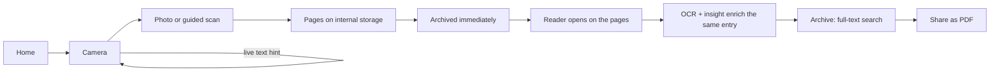
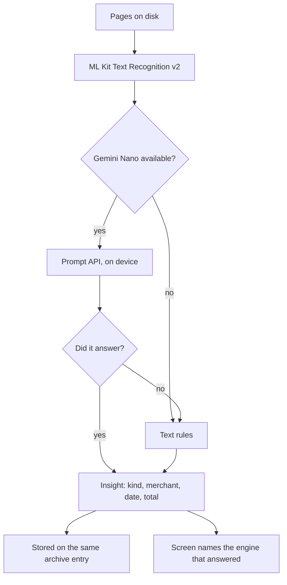
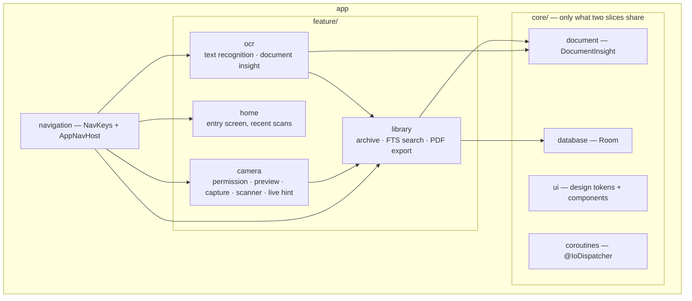
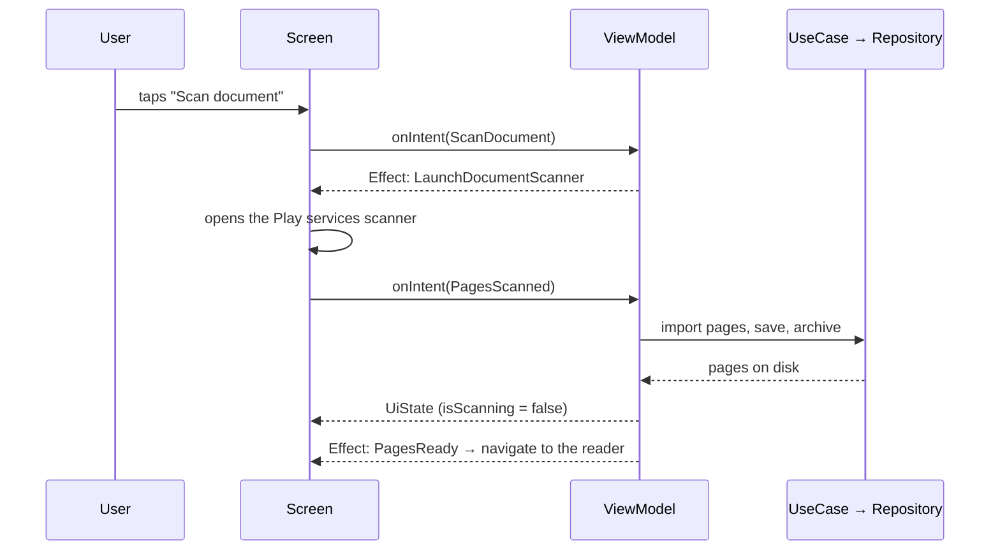

# SnapDoc

[](https://github.com/hacybeyker/SnapDoc/actions/workflows/ci.yml)
[](https://github.com/hacybeyker/SnapDoc/actions/workflows/release.yml)
[](https://sonarcloud.io/summary/new_code?id=com.hacybeyker.snapdoc)
[](https://sonarcloud.io/component_measures?id=com.hacybeyker.snapdoc&metric=coverage)
[](https://scans.gradle.com)
[](https://github.com/hacybeyker/SnapDoc/releases/latest)
[](./LICENSE)


> **Point the camera at a document and it is already filed.** SnapDoc does not stop at a photo: the
> moment the camera produces pages they are saved, read, understood and put in a searchable archive —
> and the app takes you straight to the result. All of it on the phone. **Nothing leaves the device.**

The difference is the ending. A scanner app hands you an image and leaves the work to you; SnapDoc
treats "I photographed this" as "keep this, read it, and tell me what it is". Photograph a receipt and
you land on its text with the shop, the date and the total already pulled out — and next month you find
it again by typing the name of the shop, because the archive searches what is *written inside* your
documents, not the file names.

---

## ✨ What it does

| | |
|---|---|
| **Guided scanning** | ML Kit Document Scanner: edge detection, cropping, perspective correction and multi-page scans, plus plain photo capture with CameraX |
| **Live framing help** | `ImageAnalysis` reads the viewfinder while it is open and says how much text is in frame, so the page is framed *before* the shot — with real backpressure, not a queue of stale frames |
| **A capture that finishes itself** | Saved, archived, read, and the reader opens on it. There is no "now extract the text" button, and no way to end up with a scan the app forgot to keep |
| **On-device OCR** | Text Recognition v2 per page, selectable and copyable. A page with nothing readable on it is reported as empty, not as a failure |
| **On-device understanding** | Gemini Nano through ML Kit's Prompt API classifies the document and extracts merchant, date and total. Where the model is unavailable, text rules answer instead — and the screen always says which of the two replied |
| **Searchable archive** | Room + an external-content FTS4 index over the recognized text, so a receipt is found by typing the shop that printed it |
| **PDF export** | Each page drawn onto an A4 sheet, scaled and centred, shared through a `FileProvider` under a name you can recognize in an inbox: `receipt_hardware-store_20260820_1330.pdf` |

---

## 🔄 The flow



Two things in that chain are deliberate and easy to get wrong:

- **The archive is written before anything is read.** A scan the user took is theirs whether or not
  there was readable text on it. Reading it later enriches the same entry instead of creating a second
  one — which is also how an insight upgraded by a newly downloaded model reaches the archive.
- **The camera is replaced in the back stack, not stacked on.** Once it has produced pages its job is
  over, so Back from the reader goes Home instead of to a viewfinder aimed at a document already scanned.

## 🧠 The pipeline, and what happens without a model



The generative step needs **AICore** and a supported device — Pixel 8+, Galaxy S24+ and similar.
Everything else works everywhere, and that is a design decision, not a limitation:

- **Availability is checked, never assumed.** Every call into the analyzer is contained; if the client
  cannot even be created, the app degrades instead of breaking.
- **A model that fails halfway falls back too.** Eviction, thermal throttling and a text longer than the
  context window are not reasons to leave the user with no answer while the rules can still give one.
- **The rules never invent a merchant.** "The first line is the shop" is right just often enough to be
  dangerous; a wrong shop is worse than a missing one.
- **The UI names the engine.** *Read by Gemini Nano, on this phone* vs *Read with text rules* — without
  that, an empty field would look like a document with no shop name on it.

---

## 🏗️ Architecture

**Vertical Slice** (feature-first) + the Clean dependency rule inside each slice + **MVI** in the UI.
A feature owns its `domain`, `data` and `ui`; code moves to `core/` only once a second feature needs it.



Inside a slice the dependency rule runs one way only — `ui → domain ← data` — so `domain` is pure
Kotlin with no Android imports, and it is the layer the tests spend their time in.



The Screen owns the platform handles and the ViewModel owns the state: `SurfaceRequest`, `ImageCapture`
and the scanner's `IntentSender` never enter the `UiState`. That is what keeps every ViewModel testable
on a plain JVM with hand-written fakes — no Robolectric, no mocking framework.

### Structure

```
.
├── app/src/main/java/com/hacybeyker/snapdoc/
│   ├── core/
│   │   ├── coroutines/          # @IoDispatcher qualifier
│   │   ├── database/            # Room database + Hilt module
│   │   ├── document/            # DocumentInsight — promoted once two slices needed it
│   │   └── ui/                  # design tokens (Spacing, Shapes, Type, Color) + shared components
│   ├── feature/
│   │   ├── camera/              # permission, CameraX preview, capture, guided scan, live hint
│   │   ├── home/                # entry screen with the most recent scans
│   │   ├── library/             # archive, full-text search, PDF export
│   │   └── ocr/                 # text recognition and document understanding
│   └── navigation/              # NavKeys (@Serializable) + AppNavHost (Navigation 3)
├── app/src/test/
│   ├── java/…                   # 164 JVM tests
│   └── screenshots/             # 17 committed Roborazzi goldens
├── AGENTS.md                    # source of truth for AI agents
├── config/detekt/               # detekt rules
└── gradle/libs.versions.toml    # every version, in one place
```

---

## 🎯 Key decisions

| Decision | Why |
|---|---|
| **Vertical slices over layer packages** | A change to "scanning" touches one directory, not three. `core/` only receives what two slices genuinely share — `DocumentInsight` moved there the day the archive started storing one |
| **The Screen owns platform handles, the ViewModel owns state** | `SurfaceRequest` cannot be built in a JVM test. Keeping it out of `UiState` is what makes the ViewModels testable without Robolectric or mocks |
| **One-shot events are effects, not state** | Launching the system permission dialog, opening the scanner, sharing a PDF and handing pages to the reader all travel through a `Channel`, so they fire exactly once — never again on a rotation |
| **Archive on capture, enrich on read** | Tying "archived" to "has been read" lost documents that had no readable text. The camera archives the moment pages exist; OCR updates the same entry |
| **Hand off only after the write completes** | Leaving the camera destroys its ViewModel and cancels its scope, so emitting the navigation effect early would cut the archive write in half |
| **External-content FTS4, not `LIKE '%…%'`** | The index does not keep a second copy of the OCR text — which is most of the row — and Room generates the triggers that keep the two in sync |
| **A document *is* its pages** | `imagePaths` carries a unique index, so re-reading a scan replaces its row instead of duplicating it. That is also how a better insight reaches an old entry |
| **Rules as a peer of the model, not a stub** | The fallback runs on every device where Gemini Nano is missing *or fails mid-inference*, and the UI always names which engine answered |
| **Four `KEY: value` lines, not JSON** | Gemini Nano is small: one malformed character makes a whole JSON unreadable, while a broken line only costs that field |
| **A4 pages for export, not image-sized** | A PDF whose sheets all have different shapes prints unpredictably. A tall receipt gets white margins, and that is correct |
| **`FileProvider` exposes only `cacheDir/exports/`** | Scans live in `filesDir` and stay unreachable; a share hands out exactly one URI, to one app, for as long as the intent lives |
| **Goldens for the UI, coverage for the logic** | Every visual defect this project shipped passed a green test suite. Screenshots hold the pixels still; Kover watches the code that can actually run on a JVM |
| **A pre-release dependency, documented** | `com.google.mlkit:genai-*` is the single exception to the stable-versions rule, because no stable path to Gemini Nano exists. The mandatory fallback is what contains the risk |

---

## ⌨️ Commands

| Command | What it does |
|---|---|
| `./gradlew assembleDebug` | Build the debug APK (JDK 21) |
| `./gradlew test` | 164 JVM tests — unit and screenshot, no emulator |
| `./gradlew formatAndAnalyze` | **Before every commit**: ktlint format, then ktlint + detekt + Android Lint |
| `./gradlew codeQuality` | Verification only (CI / pre-push) |
| `./gradlew koverVerifyDebug` | Coverage gate: 90% of domain, data and ViewModels |
| `./gradlew koverHtmlReportDebug` | Coverage report you can read |
| `./gradlew verifyRoborazziDebug` | Screenshot gate against the committed goldens |
| `./gradlew recordRoborazziDebug` | Re-baseline the goldens after a visual change that was meant to happen |
| `./gradlew sonar` | SonarCloud analysis (needs `SONAR_TOKEN`) |
| `./gradlew assembleRelease bundleRelease` | Release APK + AAB, unsigned |

The guided scanner needs Google Play services, so an emulator image without Play Store reports the
scanner as unavailable — by design that is a state, not a crash.

---

## 🧪 Tests and quality

164 JVM tests cover every ViewModel, the permission state machine, the live-hint debounce, the OCR and
insight pipeline including the degradation policy, the model's messy output parsing, FTS query building,
PDF page geometry, the Room mappings and the archive use cases.

**Screenshot tests** (Roborazzi + Robolectric) cover what a state assertion cannot see. The visual bugs
this project actually shipped — a scrim that stopped short of the screen edge, a scanner frame drawn
underneath the controls, a permission state with no way out — were all invisible to a green suite. The
17 goldens live in `app/src/test/screenshots/` and render on the JVM, so they run in CI with no emulator;
the camera ones pass `surfaceRequest = null`, which draws all of the chrome and none of the live feed.

What the tests deliberately do not cover is the platform plumbing — CameraX binding, the ML Kit clients,
`Bitmap`, `PdfDocument`. None of it exists on the JVM, so it is verified on a device, and the coverage
gate excludes it rather than counting lines nobody can execute.

Every gate writes an HTML report under `app/build/reports/`:

| Report | Path |
|---|---|
| Unit + screenshot tests | `tests/testDebugUnitTest/index.html` |
| Screenshot comparison | `roborazzi/debug/index.html` |
| Coverage | `kover/htmlDebug/index.html` |
| detekt | `detekt/detekt.html` |
| Android Lint | `lint-results-debug.html` |

A **pre-commit hook** runs `formatAndAnalyze` before every commit. Install it once after cloning:

```bash
chmod +x scripts/setup-quality-hook.sh && ./scripts/setup-quality-hook.sh
```

**CI** runs quality first as a cheap gate, then tests, the coverage and screenshot gates, and the debug
APK; every build publishes a **Gradle Build Scan**, and the reports are uploaded as artifacts on green
runs too. **SonarCloud** analysis runs on top, fed by the reports the local gate already produces — Lint,
detekt, ktlint and Kover — so a dashboard finding is reproducible offline, and the job fails when the
Quality Gate fails. It is skipped when `SONAR_TOKEN` is absent, so a fork still gets a green CI.

---

## 🔒 Privacy

Images, recognized text and insights stay in the app's internal storage and its Room database. There is
no analytics and no network layer to upload them with. The only thing that ever leaves is a PDF the user
explicitly shares: the `FileProvider` exposes **only** `cacheDir/exports/`, is not exported to other
apps, and grants access to the single URI handed to the chooser.

---

## 🧰 Stack

| Area | Choice |
|---|---|
| Language | Kotlin 2.4.10, JDK 21 toolchain |
| UI | Jetpack Compose (BOM 2026.08) + Material 3 |
| Navigation | Navigation 3 with type-safe `@Serializable` NavKeys |
| Camera | CameraX 1.6.2 — `camera-compose` viewfinder, capture and `ImageAnalysis` |
| Scanning | ML Kit Document Scanner (Play services) |
| OCR | ML Kit Text Recognition v2 |
| Generative AI | ML Kit GenAI Prompt API over Gemini Nano / AICore |
| Data | Room 2.8.4 with an external-content FTS4 index |
| PDF | `android.graphics.pdf.PdfDocument` + `FileProvider` |
| DI | Hilt + KSP |
| Async | Coroutines + Flow |
| Tests | JUnit4, Turbine, coroutines-test, Roborazzi + Robolectric |
| Quality | ktlint, detekt, Android Lint, Kover, SonarCloud |
| Build | Gradle 9.7.1, AGP 9.4.0, version catalog, Build Scans |
| CI/CD | GitHub Actions — CI on push and PR, release on a `v*` tag |

---

## 🤖 AI-assisted development

This project ships with infrastructure for AI agents (Claude Code, Copilot, Cursor, Junie, Antigravity…).
Start by telling your agent:

> *"Read AGENTS.md and help me implement my first feature."*

It will find the architecture rules (Vertical Slice + Clean + MVI), the coding standard and the testing
guide in `.agents/skills/`.

---

## 📄 Changelog and license

The change history lives in [CHANGELOG.md](./CHANGELOG.md).
SnapDoc is released under the [MIT License](./LICENSE).
